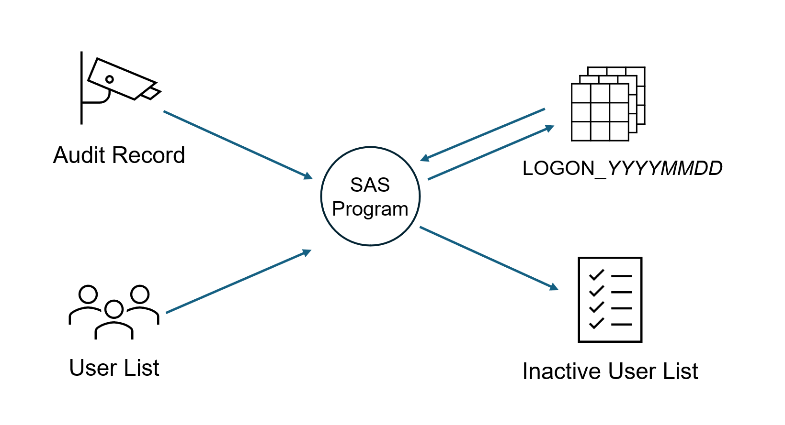
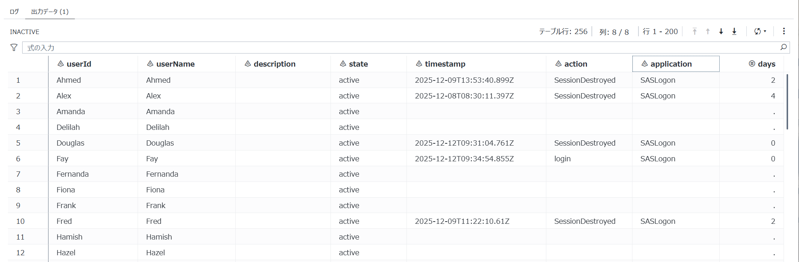

# InactiveUserList.sas 
This SAS program retrieves user lists and AUDIT logs via REST API, consolidates them, and outputs a dataset containing each user’s **last login timestamp**.
The program includes macro definitions, and you can modify parameters such as dataset names by specifying arguments for the %inactiveUserList macro.
The macros are designed to function by default to facilitate your testing.<br>
<div align="center">

</div>

By deploying this program and scheduling it to run daily, you can obtain a dataset identifying users who have not logged in for an extended period.

## Purpose & Background
SAS Viya does not provide a built-in feature to view **last login timestamps in a list format**.
This program fills that gap, enabling efficient security audits, account reviews, and operational reporting.

## Prerequisites
- This program runs on Viya4.
- The executing user must belong to the **SAS Administrators** group and have access to AUDIT records.
- A permanent library is required to store logon history data.
- In actual operation, please run this program once a day in a batch processing cycle.

## How to Run

1. Submit `InactiveUserList.sas` from SAS Studio to define the macro.
2. Write the macro %inactiveUserList in the editor, specify parameters as needed. Below is an example of executing it with default settings.

```
%inactiveUserList;
```

3. Click **Submit** to execute.
4. Verify the output dataset in the library or Explorer.
```
80   /* Default settings that can be verified for functionality */
81   %inactiveUserList;
NOTE: Dataset WORK.LOGON_20251220 has been created (obs=6)
NOTE: inactiveUserList(LIB=work, OUT=work.inactive, DAYS=60, OFFSET=0, NOTES=0, DEBUG=0) RC=0
NOTE: Dataset WORK.INACTIVE has been created (obs=256)

```

Below are several examples of macros with specified arguments.

```
/* Run with specified logon history library and output dataset. */
%libname HIST "/tla/warehouse/logon";
%inactiveUserList(lib=HIST, out=work.result);

/* Save users who have not logged in for over 60 days */
data HIST.result;
  set work.result;
  if missing(days) or days >= 60;
run;

/* Run and keep only 14 datasets of login history */
%inactiveUserList(lib=HIST, keep=14);

/* Enable debug output and run */
%inactiveUserList(lib=HIST, debug=1);

/* Changed the date to 30 days prior for debugging purposes and executed. */
%inactiveUserList(lib=HIST, offset=30);
```

## Input and Output

### Input
- **User list** retrieved via REST API  
  Example fields: `userId`, `name`, `description`, `state`
- **AUDIT logs** retrieved via REST API  
  Example fields: `userId`, `action`, `application`, `type`, `timestamp`
- **Previously aggregated dataset** containing last login history (stored after prior runs)

### Output: WORK.INACTIVE
Below is the list of output variables in the dataset specified by the out argument.

|No.|Variable|Description|
|---|---|---|
|1|userId| User ID obtained from identities service.|
|2|userName| User name obtained from the identities service. |
|3|state| State obtained from identities service. |
|4|timestamp| UTC date and time obtained from Audit record. |
|5|action| Action obtained from the Audit record, either “logon” or “SessionDestroyed”. |
|6|application| Application obtained from Audit record. |
|7|days| Number of days since last login calculated from the timestamp. To find users who have not logged in for more than 60 days, extract them using the condition "missing(days) or days>=60".|

The image of the dataset visible in SAS Studio is shown below.


### Output: &LIB..LOGON_*YYYYMMDD*
The variables for the dataset that stores the most recent logon history are shown below. 
The datasets used to store this history will keep only the number of entries specified in the optional KEEP= parameter, and older datasets will be deleted.
By default, KEEP=7, which means the most recent seven datasets are retained.

|No.|Variable|Description|
|---|---|---|
|1|userId| User ID obtained from identities service.|
|2|timestamp| UTC date and time obtained from Audit record. |
|3|action| Action obtained from the Audit record, either “logon” or “SessionDestroyed”. |
|4|application| Application obtained from Audit record. |
|5|state| State obtained from identities service. |
|6|type| Type obtained from Audit record. |

## Parameters
During testing, the macro will run without specifying arguments, but in actual operation, please specify the library and output dataset.

|No.|Parameter and Default|Description and Examples|
|---|---|---|
|1|lib=work| Specify the library to save the login history dataset. This dataset is created for each execution date, and the number of datasets specified by `keep=` will remain. |
|2|out=work.inactive|Specify the dataset to output the last login time for each user.|
|3|days=60| Specify the number of days to search for audit records. The default is to search from 60 days ago to the present. If a login history dataset already exists, the number of days will be adjusted downward based on the last timestamp in the dataset. |
|4|keep=7|Specify the number of datasets to retain for login history. The default is to keep 7 days' worth of datasets.|
|5|offset=0|This is a debug option. Set it to 1 to shift the execution date back by one day, or set it to 5 to shift it back by five days. <br>As a limitation, if logon history data newer than the specified offset exists, the audit history search range cannot be correctly specified.  |
|6|notes=0|This is a debug option. Setting it to 1 outputs messages starting with "NOTE:" to the log.|
|7|debug=0|This is a debug option. Setting it to 1 outputs debug messages to the log.|

## Error Handling & Logs
- Global macro variable **`RC`**:
  - Success: `RC = 0`
  - Error: `RC ≠ 0`
- Review logs in SAS Studio or job execution logs.

## Trouble Shooting
If the REST API endpoint cannot be resolved correctly due to certificate issues, 

```
ERROR: OpenSSL error 337047686 (0x1416f086) occurred in SSL_connect/accept at line 4978, the error message is "error:1416F086:SSL
       routines:tls_process_server_certificate:certificate verify failed".
ERROR: Secure communications error status 807ff008 description "135.149.42.217: The certificate sent from the remote host cannot be
       validated by any of the public keys in the root certificate store specified by SSLCALISTLOC or SSLCACERTDIR."
ERROR: Encryption run-time execution error
ERROR: Call to tcpSockContinueSSL failed.
```

Update the following part of the program. 
When you specify mode=1, the request is routed through the internal endpoints used by SAS Viya.

```
%macro defineBaseUrl(mode=0);
```

## How the Program Works
For those who wish to modify and use that program, the processing order is shown below.

1. Check whether the library reference name specified in the argument exists
1. Save the current date and time into a macro variable
1. Generate a list of users
1. Create a list of logon history datasets
1. If no logon history datasets exist, create an empty history dataset
1. If one or more logon history datasets exist, merge them and retain only the latest logon record
1. Extract logon and session end timestamps from AUDIT records
1. Update the logon history dataset to keep only the latest logon record
1. Join the user list with the logon history dataset by user ID to calculate elapsed days since the last login
1. Delete logon history records exceeding the retention count(keep=)

## Change Log

### [1.0] - 2025-12-22
- Initial release

## Contact
- Email: <Norio.Ogawa@sas.com>
****